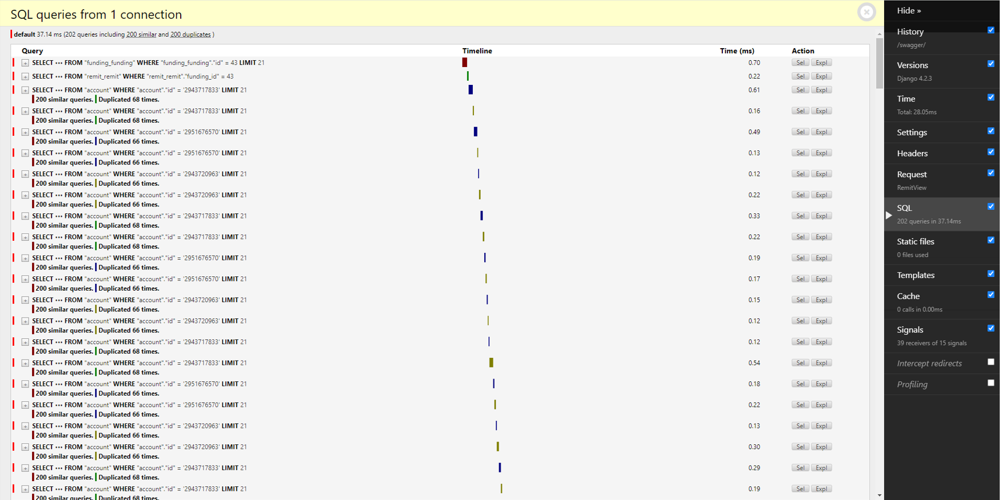
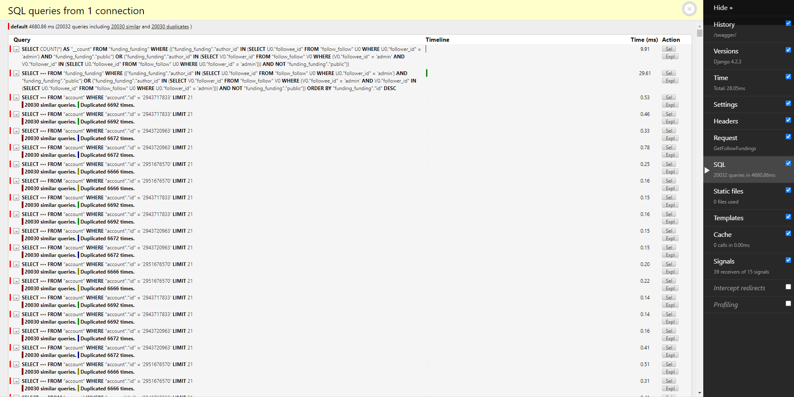

## N+1 문제란?

N+1 문제는 데이터베이스 쿼리를 처리하는 동안 발생할 수 있는 성능 문제 중 하나다.

1. 테이블의 데이터(댓글)을 가져오기 위해 쿼리를 실행한다(N번).
2. 각 데이터 마다 추가 정보(작성자)를 가져오기 위해 별도의 쿼리를 실행한다(1번).
3. 결과적으로 N번의 실행 이후 N개의 추가 쿼리 실행이 일어난다.

## 분석에 사용한 도구

- Postman : 단일 API 호출과 Runner를 이용해 테스트를 진행했다.
- Django-debug-toolbar : SQL이 어떻게 호출되는지 확인하는 데 사용했다.

## 단일 게시글의 댓글을 호출하는 API

- 댓글 : 100개

### 개선 전




쿼리를 202번이나 호출한다.

### 개선 과정

#### select_related()와 prefetch_related()

- **select_related()** : 일대일 및 외래 키 관계에 사용하며, 단일 쿼리를 사용하여 관련된 객체를 가져온다.
- **prefetch_related()** : 다대다 및 역방향 관계에 사용하며, 별도의 추가 쿼리를 사용하여 관련된 객체를 가져와 메모리에서 조합한다.

나의 경우, 외래 키 관계였기에 select_related()를 이용하여 댓글 데이터를 가져올 때 작성자에 대한 정보도 미리 로드하여 추가적인 쿼리 호출을 막았다.


그럼에도 쿼리 호출 결과는 202→102번으로 만족스럽지 못했고, 다시 검토했음에도 select_related()를 포함한 함수안에서는 특별히 이상이 있는 코드는 없었다. 문제를 파악하기 위해 댓글 객체를 이용하는 코드들을 따라가 분석해보니 serializer가 데이터를 직렬화하는 과정에서 그 이유를 찾을 수 있었다.  
댓글의 작성자 정보를 추가할 때 쿼리 호출을 하고 있었고, 이는 외래키 참조를 통해 해결했다.

민망한 코드였다.

### 개선 후


쿼리 호출 수를 비약적으로 줄인 결과 평균 응답 시간이 10배 넘게 줄었다.


페이징을 통해 한 번에 8개의 댓글만 불러오게 수정해 추가적으로 성능 개선을 했다.  
django에서 제공하는 Paginator라이브러리는 카운팅 쿼리 호출이 강제적이어서 함수를 새로 작성했다.

편리하고 재미있는 기능을 많이 구현하더라도 서버에 과부하가 오는 등 문제가 생기면 쓸 수 없다.  
차라리 견고하고 단단한 기능 하나가 더 유용하리라 느꼈다.

### 추가 내용

1. 게시글이 존재하는데 댓글이 없어서 빈 배열 return
2. 게시글이 존재하지 않아 빈 배열 return

현재 두 가지 상황을 구분하기 위해 API 요청 시 게시글 확인을 위해 쿼리 선택을 한 번 진행한다. 게시글에 대해서 댓글은 cascade 관계이므로 이 과정을 생략할지 고민 중이다.

## 팔로우 중인 사람들의 게시글 리스트 API

- 글 : 10000개

### 개선 전



포스트맨으로 테스트를 진행하면 사고가 날 것을 예상해 단일 호출만 해봤다.  
처리 시간만 4680.86ms가 걸린다.

### 개선 과정

1. 쿼리에 대한 조건을 나누어 생각했다.

- 내가 팔로우 하는 사람의 전체 공개 게시글
- 서로 팔로우 하는 사람의 친구 공개 게시글

두가지로 나누어 이에 대한 쿼리문을 작성 후 OR 연산을 통해 합쳤다.

2. **select_related()**
   메서드를 이용하며 remit과 동일하게 serializer 부분을 수정해주었다.

아래는 코드이다.

```python
#내가 팔로우한 사람들
followee_users = Follow.objects.filter(follower=user.id).values_list('followee')
#나를 팔로우한 사람들
follower_users = Follow.objects.filter(followee=user.id).values_list('follower')

# 사용자가 팔로우한 사용자들의 펀딩 가져오기
fundings = Funding.objects.filter(
    Q(author__in=followee_users) & (Q(public=True) |
		# 내가 팔로우한 사람들의 공개 펀딩
    (Q(public=False)&Q(author__in=follower_users)))
		# 비공개 펀딩 중 사용자가 작성자를 팔로우한 경우
).order_by('-created_on').select_related('author')
```

### 개선 후


중복 쿼리를 없앴으며, 속도가 33.39ms 로 비약적으로 상승했다.  
이후 페이징 처리를 통해 12.19ms까지 향상 시켰다.
