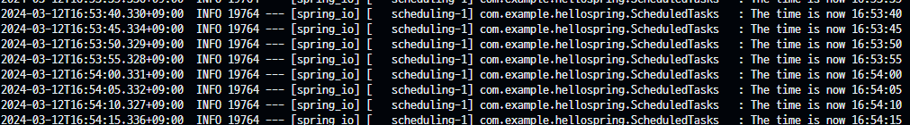

## What You Will Build

Spring의 @Scheduled 어노테이션을 이용하여 5초에 한번씩 현재 시간을 출력하는 어플리케이션을 만들어보자.

## Adding awaitility Dependency

Task Scheduling을 위해서 awaitility 라이브러리를 추가해야 한다.

**build.gradle**

```build.gradle
dependencies {
	implementation 'org.springframework.boot:spring-boot-starter'
	testImplementation 'org.awaitility:awaitility:4.2.0'
	testImplementation('org.springframework.boot:spring-boot-starter-test')
}
```

## Create a Scheduled Task

**src/main/java/com/example/schedulingtasks/ScheduledTasks.java**

```Java
package com.example.schedulingtasks;

import java.text.SimpleDateFormat;
import java.util.Date;

import org.slf4j.Logger;
import org.slf4j.LoggerFactory;
import org.springframework.scheduling.annotation.Scheduled;
import org.springframework.stereotype.Component;

@Component
public class ScheduledTasks {

	private static final Logger log = LoggerFactory.getLogger(ScheduledTasks.class);

	private static final SimpleDateFormat dateFormat = new SimpleDateFormat("HH:mm:ss");

	@Scheduled(fixedRate = 5000)
	public void reportCurrentTime() {
		log.info("The time is now {}", dateFormat.format(new Date()));
	}
}
```

예제에서는 `fixedRate`를 이용했지만, `fixedDelay`나 `cron`을 사용하여 스케줄링을 할 수도 있다.  
`cron`의 경우 `"0 * * * * MON-FRI"`로 설정하면 월-금동안 1분에 한번씩 실행된다.

## Enable Scheduling

**src/main/java/com/example/schedulingtasks/SchedulingTasksApplication.java**

```Java
'''
생략
'''

@SpringBootApplication
@EnableScheduling
public class SchedulingTasksApplication {

	public static void main(String[] args) {
		SpringApplication.run(SchedulingTasksApplication.class);
	}
}
```

@EnableScheduling 어노테이션을 통해 background task executor가 생성되었다는 것을 명시한다.

## 결과


