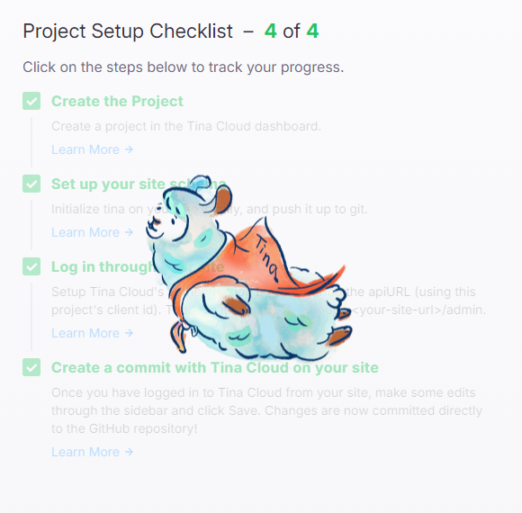

개발 블로그를 시작하며 저만의 사이트를 가지고 싶었던 마음에 Hugo와 깃허브의 도움으로 호스팅하고 있었습니다.\
시간은 조금 걸리지만 제 입맛대로 조금씩 꾸며져가는 블로그를 보고 있으니 뿌듯한 마음이 들면서도, 글을 작성할 때 IDE를 사용하여 작성하다 보니 다음과 같은 불편함이 있었습니다..

1. hugo 실행 및 preview 화면을 따로 확인해야 하는 번거로움
2. 로컬 환경, 특히 세팅되어 있는 컴퓨터에서만 작성 가능함

이러한 사항들은 글을 작성하는 시간을 오래걸리게 할 뿐 아니라 글을 쓰려는 의지마저 저하시켰습니다. 이를 개선하기 위해 정보를 찾던 중 TinaCMS를 알게 되었고, 다음들을 적용시켜 게시글 관리를 하기로 했습니다.

1. TinaCMS
2. GitHub Action

## TinaCMS


[TinaCMS](https://tina.io/ "tina.io")는 컨텐츠를 관리하기 위한 프레임워크로 사이트 편집을 원활하게 할 수 있도록 도와줍니다. 제가 파악한 바로는 다음의 주요 기능들이 있습니다.

1. 게시글의 CRUD
2. Tina Cloud를 통해 온라인 편집
3. 컴포넌트를 연결하여 랜더링되는 화면에서 직접 편집

그 중 저는 2번까지만 적용하여 블로그를 관리하려고 합니다.

### Setup TinaCMS

블로그 디렉토리에서 다음 명령어를 실행합니다.

```shell
npx @tinacms/cli@latest init
```

public assets directory는 미디어를 관리하는 디렉토리를 묻는 것이기에, Hugo 기준 static을 입력하시면 됩니다.

### 컨텐츠 모델링하기

Tina를 이용하여 컨텐츠를 관리하기 위해, tina/config.ts파일에서 관련 설정을 해야합니다.\
저는 카테고리를 기반해 게시글 설정을 했습니다. 아래는 schema -> collections > 하위의 springboot collection 설정입니다.

```typescript
{
  name: "springboot",
    label: "SpringBoot",
      path: "content/post/backend-studies/springboot",
        defaultItem: () => {
          return {
            image: "/cover/springboot.png",
            title: "[Spring Boot] ",
            date: new Date(),
            slug: (values) => values?.title
              ?.toLowerCase()
              .replace(/ /g, '-'),
            categories: ['Backend Studies'],
            tags: ['Spring Boot'],
          }
        },
          ui: {
    filename: {
      // if disabled, the editor can not edit the filename
      readonly: true,
        // Example of using a custom slugify function
        slugify: (values) => {
          // Values is an object containing all the values of the form. In this case it is {title?: string, topic?: string}
          return `${values?.title
            ?.toLowerCase()
            .replace(/ /g, '-')}/index`
        },
          },
  },
  fields: [
    {
      type: "image",
      name: "image",
      label: "커버 이미지",
      required: false,
    },
    {
      type: "string",
      name: "title",
      label: "제목",
      isTitle: true,
      required: true,
    },
    {
      type: "string",
      name: "slug",
      label: "slug",
      isTitle: false,
      required: false,
      description: "한글 포함 시 작성",
    },
    {
      type: "string",
      name: "description",
      label: "설명",
      isTitle: false,
      required: false,
    },
    {
      type: "datetime",
      name: "date",
      label: "작성일",
      required: false,
    },
    {
      name: 'categories',
      label: '카테고리',
      type: 'string',
      list: true,
      options: [
        {
          value: 'Backend Studies',
          label: 'Backend Studies',
        },
        {
          value: 'Algorithm',
          label: 'Algorithm',
        },
        {
          value: 'Languages',
          label: 'Languages',
        },
        {
          value: 'Tech Articles Reviews',
          label: 'Tech Articles Reviews',
        },
        {
          value: 'Misc',
          label: 'Misc',
        },
      ],
    },
    {
      type: "rich-text",
      name: "body",
      label: "Body",
      isBody: true,
    },
    {
      label: "Tags",
      name: "tags",
      type: "string",
      list: true
    },
  ],
}
```

`name`은 value, `label`은 Tina에서 보여줄 이름입니다.\
`path`는 게시글들이 존재하는 경로를 기입해주시면 됩니다.\
`defaultItem`은 게시글 작성 시 자동으로 설정될 데이터입니다. 저는 커버 이미지, 제목 양식, 작성일, 카테고리, 태그 등을 설정했습니다.\
`fields`는 마크다운 파일의 설정입니다.

더 자세한 설정은 [이 곳](https://tina.io/docs/reference/collections/ "tina_collections")에서 확인해보세요!

> `ui:filename`은 제가 hugo의 stack테마를 기반으로 작성하고 있기 때문에, 이를 위해 그냥 filename.md로 저장하는 게 아닌, filename/index.md로 저장하게끔 수정했습니다. 현재 Media 핸들링을 위해 저도 디렉터리 구조의 변경을 고려하고 있으며, 참고만 하시면 될 것 같습니다.

```shell
npx tinacms dev -c "hugo server -D -p 1313"
```

설정을 마친 후 서버를 실행한 뒤 localhost:1313/admin 으로 접속하면 Tina페이지를 볼 수 있습니다.


collection 선택 후 Create New 버튼을 클릭하게 되면 글 양식에 맞게 화면이 나오는 것을 볼 수 있습니다.

```markdown
---
image: /cover/springboot.png
title: "[Spring Boot] Messaging with Redis"
description: using Spring Data Redis to publish and subscribe to messages sent with Redis.
date: 2024-03-15T12:08:56.000Z
categories:
  - Backend Studies
tags:
  - Spring Boot
---

## What You Will Build

`StringRedisTemplate`를 이용하여 메세지를 게시하고, `MessageListenerAdapter`를 이용하여 메세지를 가져오는 POJO를 구현해봅시다.
```

실제 작성 시 위와 같은 md파일이 생성됩니다.

body의 경우, md형식으로 작성하거나 미리보기의 형태로 글을 작성해볼 수 있습니다.\
다만 저는 hugo컴포넌트와 연결하지는 않았기 때문에 Hugo에서의 미리보기 형태는 아닙니다.

### Tina Cloud

Local에서의 실행이 문제 없이 된다면, 온라인으로도 편집하기 위해 Tina Cloud를 이용해봅시다.

1. [Tina Cloud](https://app.tina.io/ "Tina Cloud") 계정 만들기
2. 프로젝트 생성하기\
   1\. Site URLs은 호스팅될 주소를 입력해주세요(ex : [https://skay138.github.io](https://skay138.github.io))\
   2\. Repository는 블로그에 대한 Repository를 설정해주세요(ex : [https://github.com/skay138/skay138.github.io](https://github.com/skay138/skay138.github.io))

Tina Cloud 설정이 끝났다면 Backend 구축을 해야합니다.

```shell
npx @tinacms/cli init backend
```

커맨드를 실행하게 되면 tina/config.ts 파일이 수정되고, root 디렉토리에 .env가 추가될 겁니다.

```typescript
// Your hosting provider likely exposes this as an environment variable
const branch =
  process.env.GITHUB_BRANCH ||
  process.env.VERCEL_GIT_COMMIT_REF ||
  process.env.HEAD ||
  "main";

export default defineConfig({
  branch,

  // Get this from tina.io
  clientId: process.env.TINA_PUBLIC_CLIENT_ID,
  // Get this from tina.io
  token: process.env.TINA_TOKEN,
```

여기서 TINA_PUBLIC_CLIENT_ID가 기존에는 PUBLIC_TINA_CLINET_ID거나 다른 변수명일텐데 수정해 주세요!\
로컬에서 실행시킨다면 .env도 맞춰서 수정해주셔야 합니다.

- TINA_PUBLIC_CLIENT_ID : Tina Cloud의 Client ID
- TINA_TOKEN : Tina Cloud의 Tokens/Content(Read only)

## GitHub Action

저는 GitHub Pages를 이용해 호스팅을 했습니다. 만약 [Vercel](https://tina.io/docs/tina-cloud/deployment-options/vercel)이나 [Netlify](https://tina.io/docs/tina-cloud/deployment-options/netlify)를 이용한다면 각각 페이지를 참고해주세요.

**.github/workflows/static.yml**

```
# Simple workflow for deploying static content to GitHub Pages
name: Deploy static content to Pages

on:
  # Runs on pushes targeting the default branch
  push:
    branches: ["main"]

  # Allows you to run this workflow manually from the Actions tab
  workflow_dispatch:

# Sets permissions of the GITHUB_TOKEN to allow deployment to GitHub Pages
permissions:
  contents: read
  pages: write
  id-token: write

# Allow only one concurrent deployment, skipping runs queued between the run in-progress and latest queued.
# However, do NOT cancel in-progress runs as we want to allow these production deployments to complete.
concurrency:
  group: "pages"
  cancel-in-progress: false

jobs:
  # Single deploy job since we're just deploying
  deploy:
    environment:
      name: github-pages
      url: ${{ steps.deployment.outputs.page_url }}
    runs-on: ubuntu-latest
    steps:
      - name: Checkout
        uses: actions/checkout@v4
        with:
          submodules: true

      - name: Setup Node
        uses: actions/setup-node@v4
        with:
          node-version: "16"

      - name: Cache node modules for TinaCMS
        id: cache-npm
        uses: actions/cache@v3
        env:
          cache-name: cache-node-modules
        with:
          # npm cache files are stored in `~/.npm` on Linux/macOS
          path: ~/.npm
          key: ${{ runner.os }}-build-${{ env.cache-name }}-${{ hashFiles('**/package-lock.json') }}
          restore-keys: |
            ${{ runner.os }}-build-${{ env.cache-name }}-
            ${{ runner.os }}-build-
            ${{ runner.os }}-

      - if: ${{ steps.cache-npm.outputs.cache-hit != 'true' }}
        name: List the state of node modules
        continue-on-error: true
        run: npm list

      - name: Install dependencies
        run: npm install

      - name: Build TinaCMS
        env:
          TINA_PUBLIC_CLIENT_ID: ${{ secrets.TINA_PUBLIC_CLIENT_ID }}
          TINA_TOKEN: ${{ secrets.TINA_TOKEN }}
        run: npx tinacms build

      - name: Setup Hugo
        uses: peaceiris/actions-hugo@v2
        with:
          hugo-version: "0.123.8"
          extended: true

      - name: hugo build
        run: |
          hugo

      - name: Setup Pages
        uses: actions/configure-pages@v4

      - name: Upload artifact
        uses: actions/upload-pages-artifact@v3
        with:
          # Upload entire repository
          path: "./public"

      - name: Deploy to GitHub Pages
        id: deployment
        uses: actions/deploy-pages@v4

```

name을 따라가시면 쉽게 파악하실겁니다. 언제 실행할 지 등 기호에 맞게 수정해주세요!\
Build TinaCMS -> Setup Hugo 순서는 맞춰주시는 게 좋습니다.

### 환경 세팅

깃허브 레파지토리의 Settings -> Environments -> github-pages에 환경변수를 추가해주세요.\
Environment secrets에 TINA_PUBLIC_CLIENT_ID과 TINA_TOKEN를 넣어주시면 됩니다.


이후, main 브랜치에 push될 때마다 자동으로 블로그가 build됩니다.

### 오류 관련

1. 환경 세팅 및 변수명이 제대로 되어 있는 지 확인해 주세요.
2. branch설정 확인 : master branch 안될 수 있습니다.
3. submodule 확인 : 이부분에서 좀 헤맸었는데 theme을 submodule로 관리하신다면 GitHub Action 중 Checkout step에서 `submodules: true` 설정을 해주셔야 hugo build 부분이 제대로 빌드가 됩니다.
4. hugo build 확인 : config.toml에 따라 hugo -t stack 등 명령어가 상이할 수 있습니다.

## 결과 확인

호스팅 되는 주소/admin 으로 접속하시면 Tina에 로그인할 수 있습니다.\
로그인 후 게시글 생성/수정/삭제를 했을 때 github에 commit이 올라가며 페이지가 빌드되시는 것을 확인할 수 있습니다.




Tina Cloud 페이지에서 Setup Checklist로 제대로 연결이 되었는지도 확인하실 수 있습니다.

## 후기

TinaCMS으로 게시글 작성이 많이 편해졌으나 다음과 같은 사항들은 존재합니다.

1. 임시저장 없음\
   게시글을 저장하거나, Media를 올릴 때 마다 commit이 올라가기에 저는 글을 다 작성 후 저장하고 있었습니다. 하지만 이 때문에 글을 통째로 날려버리게 된 후 그냥 신경안쓰고 commit을 날리고 있습니다.\
   또한 글을 작성하다 왼쪽 메뉴를 클릭하게 되신다면 소리없이 사라져버리는 글을 볼 수 있습니다 주륵. . .
2. 데이터 관련 오류\
   Markdown이 가끔 제대로 먹지 않거나, 파일을 찾을 수 없는 문제가 종종 발생합니다.
3. Media 관리\
   미디어 업로드 시 이름 변경이 안됩니다. 미리 이름을 설정하시고 업로드 하셔야 해요.
4. Stack 테마와 완벽히 호환안됨\
   이것은 어찌보면 당연하지만 기존 구성에 대해 미디어와 관련해 안맞는 부분이 있습니다.\
   static에서 가져오는 미디어는 caption이 보이지 않으며, 중앙 정렬이 안됩니다.

그럼에도 VSCode등 별도의 IDE나 세팅없이 새로운 글을 작성하고, 바로 Deploy할 수 있는 것은 너무 매력적입니다.\
이 글을 보시는 분들도 한번 적용해보시기 바랍니다.
